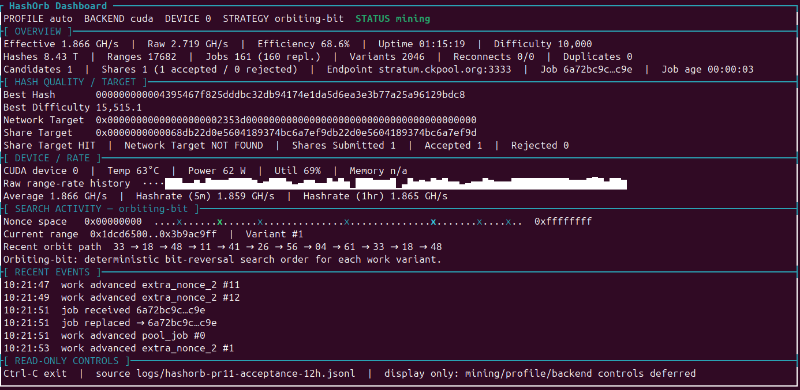

# HashOrb

**Exploring Bitcoin, hashing, GPU compute, and AI-assisted software development.**

HashOrb is an experimental Bitcoin hashing and mining project that I am building as a hands-on way to learn more about:

- Bitcoin mining and the Bitcoin protocol
- SHA-256 hashing and nonce search
- Stratum mining and Bitcoin Core
- CPU and NVIDIA CUDA compute
- Search strategies
- AI-assisted software engineering
- CI/CD, testing, security, and developer tooling

HashOrb is an active **pre-release learning project**. It is not intended to compete with ASIC mining hardware or to claim improved Bitcoin mining probability.

Project site: <https://hashorb.com>

## Quick Start

Want to run it rather than read about it first?

**[Quick Start: Linux, macOS, Windows, and Docker](docs/QUICKSTART.md)**

The guide walks from a fresh checkout to a short bounded Stratum mining run using a public Bitcoin receive address. HashOrb never needs a seed phrase, private key, or wallet password for that path.

## Simple Multi-Machine Mining

HashOrb intentionally uses a simple scale-out model: **one independent HashOrb miner per machine**.

If you want to mine from several computers through CKPool, install HashOrb on each machine and configure the same Bitcoin payout address. CKPool accepts the Bitcoin address as the Stratum username and allows an optional worker extension. Each HashOrb instance maintains its own Stratum session and receives its own work, so HashOrb does not need a distributed coordinator or swarm layer.

This keeps multi-machine mining operationally simple: add another machine by installing and configuring another independent HashOrb instance.

## Why I Built It

HashOrb started with a simple question:

> Can I build a Bitcoin hashing system from the ground up and use the process to better understand both Bitcoin and modern AI-assisted engineering?

The project has become a practical environment for experimenting with Bitcoin internals, Python, native code, CUDA, automation, testing, observability, and different ways of navigating a large search space.

It is also a way for me to explore how tools such as **GitHub Copilot and other AI coding assistants** can support a real engineering project, from architecture and implementation to testing, troubleshooting, documentation, and CI/CD.

## What I'm Learning

### Bitcoin

HashOrb gives me a practical way to explore:

- Bitcoin block headers
- Double SHA-256 hashing
- Mining targets and difficulty
- Nonces and search spaces
- Stratum jobs and share submission
- Bitcoin Core RPC
- Solo mining and block construction

### AI-Assisted Engineering

I use AI throughout the development process to help:

- Explore architecture and implementation ideas
- Review and reason about code
- Generate and improve tests
- Troubleshoot failures
- Refactor implementations
- Develop technical documentation
- Experiment with agent-assisted development workflows

AI is used as an engineering tool rather than a replacement for validation. Hashing correctness, protocol behavior, tests, and security boundaries are verified independently.

## Technology

| Area | Tools |
|---|---|
| Language | Python 3.13 |
| CPU compute | Python and native C |
| GPU compute | NVIDIA CUDA |
| AI-assisted development | GitHub Copilot and AI coding tools |
| CI/CD | GitHub Actions |
| Containers | Docker |
| Python tooling | uv |
| Platforms | Linux, macOS, Windows CPU path, NVIDIA DGX Spark |
| Bitcoin | Stratum, Bitcoin Core RPC |
| Quality | pytest, Ruff, mypy |
| Security | Gitleaks, Trivy, Bandit, pip-audit |

## Compute Backends

HashOrb currently has several compute paths:

- **Python** — correctness reference
- **Native C** — optimized CPU execution
- **Native parallel** — multi-threaded CPU execution
- **CUDA** — NVIDIA GPU hashing
- **CUDA multi-device** — experimental interface for explicitly selected devices; broader multi-GPU validation is still in progress

The project separates **how hashes are calculated** from **how portions of the search space are selected**.

## Search Strategies

Built-in search orders include:

- **Sequential** — reference range order
- **Orbiting Bit** — deterministic bit-reversal range order
- **Fibonacci Bounce** — deterministic Fibonacci-derived range permutation

These strategies change the order in which ordinary nonce ranges are explored. They do **not** claim to increase the probability of finding a valid Bitcoin hash.

## Quick Examples

Check the local environment:

```bash
hashorb doctor
```

Run an offline CPU benchmark:

```bash
hashorb compute-benchmark \
  --backend python \
  --hash-count 100000
```

Run an offline CUDA benchmark on a supported NVIDIA system:

```bash
hashorb compute-benchmark \
  --backend cuda \
  --device 0 \
  --hash-count 1000000
```

### Mine Bitcoin through CKPool

Set your public Bitcoin receive address in `.env`, then explicitly enable live Stratum and mining for the current shell:

```bash
export HASHORB_ENABLE_LIVE_STRATUM=1
export HASHORB_ENABLE_LIVE_MINING=1

hashorb stratum-mine \
  --profile auto \
  --max-runtime-seconds 300 \
  --log-file logs/events.jsonl
```

That performs a real, bounded five-minute mining run. See the [Quick Start](docs/QUICKSTART.md) for setup on Linux, macOS, Windows, Docker, and supported NVIDIA CUDA systems.

HashOrb keeps live Bitcoin operations explicitly opt-in. Offline diagnostics and benchmarks do not require a mining pool or Bitcoin wallet.

### Bitcoin Core

Bitcoin Core operations are deliberately separated into three commands:

- `hashorb bitcoin-core-check` inspects Bitcoin Core readiness and templates without mining.
- `hashorb solo-hash` performs bounded hash-only work and cannot earn a reward because it has no submission capability.
- `hashorb solo-mine` is the explicit submission-capable true-solo mining path.

See [Bitcoin Core true solo](docs/14-bitcoin-core-true-solo.md) for configuration and live-operation details.

## Dashboard

HashOrb includes a terminal-based view for watching hashing activity and runtime information.



## Engineering the Project

HashOrb is also an experiment in building a small software project with production-style engineering practices.

The repository includes:

- Automated GitHub Actions workflows
- Unit and regression testing
- Static analysis and type checking
- Dependency and secret scanning
- Docker packaging
- Security checks
- Architecture documentation
- Reproducible development tooling
- Pull request based development

The goal is not simply to make hashing code work, but to learn how to build, test, document, secure, and evolve the project responsibly.

## Documentation

The README intentionally stays high level.

Start with the **[documentation index](docs/README.md)** for a plain-language map of the technical docs, or jump directly to:

- [Quick Start](docs/QUICKSTART.md)
- [Architecture](ARCHITECTURE.md)
- [Stratum and compute design](docs/03-stratum-and-compute-design.md)
- [Compute backends](docs/05-compute-backends.md)
- [Search strategies](docs/08-search-strategies.md)
- [Performance profiles](docs/12-performance-profiles.md)
- [Installation and packaging](docs/13-installation-and-packaging.md)
- [Bitcoin Core true solo](docs/14-bitcoin-core-true-solo.md)
- [Security](SECURITY.md)

## Support HashOrb

HashOrb is free and open source. If you find it useful and want to support continued development, testing, and documentation, you can contribute in either of these ways:

- ☕ **Buy Me a Coffee:** <https://buymeacoffee.com/hashorb>
- ₿ **Bitcoin:** `bc1qgr9cv6n8tl33k96q2nxk6cf9gj2f7asjj264te`

Bitcoin contributions should be sent on the Bitcoin network.

## License

HashOrb is licensed under the **Apache License 2.0**. See [LICENSE](LICENSE) for the full terms and [NOTICE](NOTICE) for project attribution.

## Project Status

🚧 **Active development / pre-release**

HashOrb continues to evolve as I learn more about Bitcoin, GPU computing, AI-assisted engineering, and maintainable software development.

Feedback and technical discussion are welcome.
